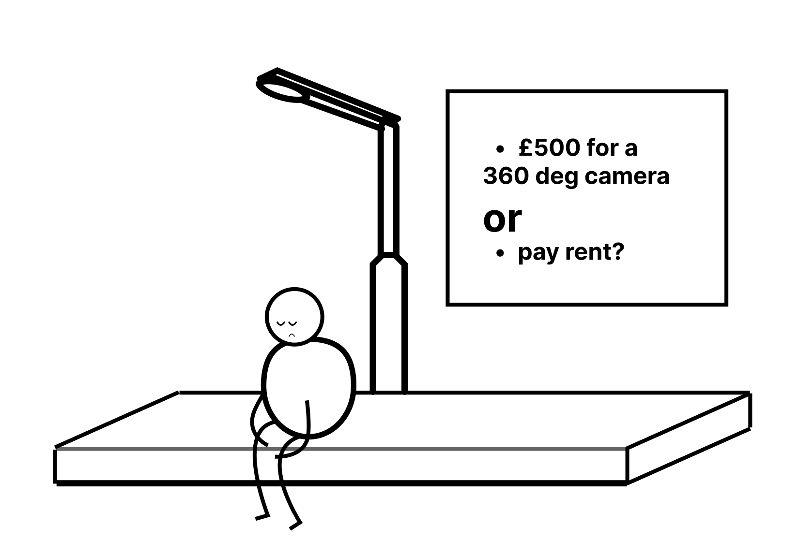

# Facial Detection and Localisation
Essentially what i want to do is to identify a face and then find out 
how far away it is from the camera. A best case scenario would be i get 
to see a vector (x, y, z) representing this distance.

Here's a preview of what we get in the end, it's not the finished product so do actually read this:


## Camera & Open CV
First part of this problem was to get the camera working. inside `facial-deteciton.py`
is my first exploration with getting opencv working on my machine. 
This also introduced me to Haar Cascades which is supposedly the same way 
the iPhone X does face ID. This also gave me some insight into focal lenghts 
and camera. 

Then inside `main.py` we use Googles mediapipe library to perform iris detection 
since googles face mapping represents facial landmarks this is the best way of tracking 
iris's since it uses the rest of the face to predict where the irsis's are. While doing 
this part of the project I discovered that the iris of a person is always about 17mm.

This is going to be useful for the nxt part of the logic:


To keep the units the same I will need to convert the units of the focal lenght in pixels.
Here are the stats of my webcam i will be using:

```
webcam_resolution = 1280x720 px
sensor_size = 24nm
focal_length = 50nm
```

This lets me calculate the focal length (of the horizontal) in terms of px.

We'll pick this back up later but it's important to know. If you look inside `main.py` you'll
see the logic built to recognise each iris. I've also added axis and drew a line to the iris to 
somewhat show how the camera will be placed. 

## 3D rendering

I've never rendered 3D objects in python. So the first thing i did was look online for 
a library that lets you render 3D objects. I might change this to be my own custom game engine
but I'm pretty lazy so i'll just use the library [ursina engine](https://www.ursinaengine.org). 
I started by building a cube, which was pretty simple (literally 10 lines of code)

```python
from ursina import *

app = Ursina()
cube = Entity(model="cube", color=color.azure, texture="white-cube", scale=1)

def update():
    cube.rotation_x += 1

app.run()
```

super super useful, since i don't want this to be too difficult. This means i'll be able to combine
the two pieces of code together. 

However this is where i ran into problems. Unfortunately when you try to use ursina with open cv it breaks.
I spent a day debugging when i gave up. Then the next best thing was multi-threading, but since ursina uses 
decorators it's got some weird behaviour and i wasn't able to understnad how the program is being compiled.

It would say my camera was on but the opencv window wasn't running. FUCK THIS SHIT!!

## Flask Server!
Okay, so my `main.py` file contains the opencv code which is able to determine my face position in terms of pixesl 
and my `3d-cube.py` file is able to render a cube (and also move the camera because i added that functionality too).
Now the next step is whenever `update()` is called, the 3d cube file should make a request to the opencv file to get the 
iris positioning. To decouple the program i built a flask server that has 4 routes:
- `/setx?x_pos={x_position}`: which will update the variable x_position to the parameter passed into the URL 
- `/sety?y_pos={y_position}`: do the same thing as above but for a new variable y_positoin
- `/get_x`: this returns the value of the variable x_position inside the flask server
- `/get_y`: this returns this does the same thing as above but for the y_position variable instead

Now inside `main.py` inside the while loop call a function that calculates the mean value for (x,y) for the iris's
and make a request to update the variable. 

Similarly inside `3d-cube.py` send a get request to the '/get_x' and '/get_y' to get the 
face position and update the camera position respectively.

## Bringing it all together 
Fuckin hell, that was cool. But now i need to run three files independatly before i can get it to work.
Since this is a bit of a pain instead what i'll do is to make a bash script that runs all three concurrently.

```bash
#! /bin/bash

flask --app db/flash-server run &
python3 main.py &
python3 3d-rendering/3d-cube.py

```

Sickkkk!!! It works now!

Heres the demo!


## Poverty + 360 Camera

So... I wanted to be able to track my face anywhere the camera could see me. Unfortunately that fuckin thing costs like 
£500. Now I still have crippling credit-card debt so I'm not about to buy one. But i remember my Computer Vision lecturer
saying you can use SIFT features to map to two images and create panoramas. Pretty sure a panorama is the exact thing 
i'm looking for... inside `panorama.py` you'll see me use opencv to get the SIFT features and descriptors. Then map them.
Now i should probably say this shit was all opencv i didn't really do any of it. But it worked!


## Next steps 
Okay so I'm not finished but i think this is a good place to take a break. 
Next steps for me is to reformat this project and make the camera rotate to point to the origin.

Also going to add a better model, as well as some generic UI. 

## Social Media
check me out on stuff, my instagram got banned because i accidentally told them i was 13. 
- [Linkden - Elijah Ahmad](https://www.linkedin.com/in/elijah-ahmad-658a2b199/)
- [FaceBook - Elijah Ahmad](https://www.facebook.com/elijah.ahmad.71)
- [Instagram - @ElijahAhmad__](https://www.instagram.com/ElijahAhmad__)
- [Snapchat - @Elijah.Ahmad](https://www.snapchat.com/add/elijah.ahmad)


